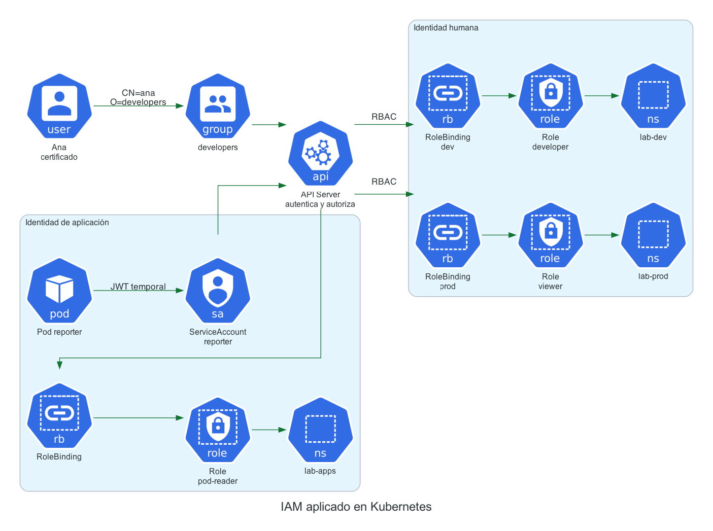
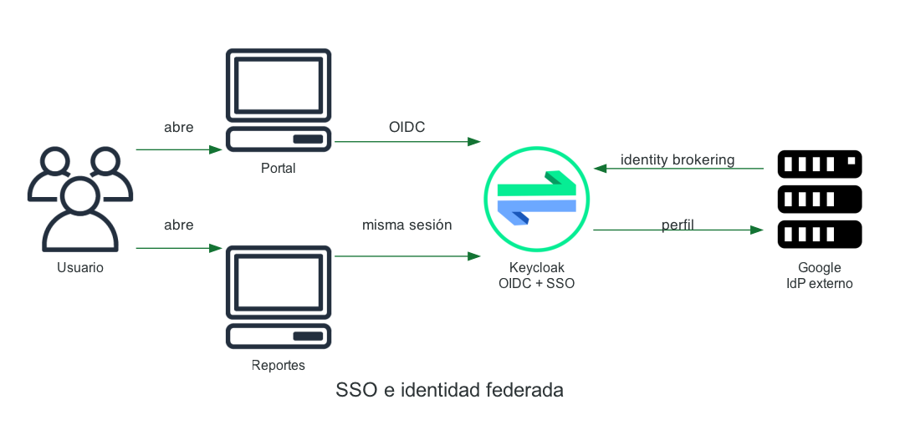

# Módulo 4 · Clase 1 — IAM aplicado en Kubernetes

Laboratorio intermedio y guiado para una clase de aproximadamente **1 h 20 min**.

El objetivo no es memorizar YAML. Vamos a seguir una solicitud real hasta entender cuatro preguntas:

1. **¿Quién** hace la solicitud?
2. **¿Cómo** demuestra su identidad?
3. **¿Qué acción** intenta realizar y sobre qué recurso?
4. **¿Qué regla** permite o rechaza esa acción?

Al terminar vas a haber creado una identidad humana con certificado, permisos por grupo, una identidad para una aplicación mediante `ServiceAccount`, vas a inspeccionar el JWT y las claves JWKS que Kubernetes usa para verificarlo y vas a autenticar dos aplicaciones simples mediante Keycloak.

## Mapa del laboratorio



```text
Ana ──certificado──> API Server ──RBAC──> lab-dev / lab-prod

Pod reporter ──ServiceAccount JWT──> API Server ──RBAC──> lab-apps
                         │
                         └── kid del JWT ↔ clave publicada en JWKS
```

## Qué vas a comprobar

| Identidad | Acción | Alcance | Resultado esperado |
|---|---|---|---|
| `ana` / grupo `developers` | listar Pods | `lab-dev` | ✅ Permitido |
| `ana` / grupo `developers` | actualizar Deployments | `lab-dev` | ✅ Permitido |
| `ana` / grupo `developers` | listar Pods | `lab-prod` | ✅ Permitido |
| `ana` / grupo `developers` | actualizar Deployments | `lab-prod` | ❌ Denegado |
| `ana` / grupo `developers` | leer Secrets | cualquier namespace | ❌ Denegado |
| ServiceAccount `reporter` | listar Pods | `lab-apps` | ✅ Permitido |
| ServiceAccount `reporter` | leer Secrets | `lab-apps` | ❌ Denegado |

## Requisitos

- Docker funcionando.
- `kubectl`.
- `kind`.
- `openssl`.
- `jq`.
- Python 3.
- `curl`.

En macOS con Homebrew:

```bash
brew install kind kubectl jq openssl
```

> Antes de la clase conviene ejecutar `make preflight` y `make cluster`. La descarga inicial de imágenes no forma parte del tiempo pedagógico.

## Cronograma sugerido

| Tiempo | Actividad | Concepto IAM |
|---:|---|---|
| 0–7 min | Preparación y mapa mental | sujeto, credencial, acción, recurso |
| 7–17 min | Crear a Ana y su certificado | autenticación de personas |
| 17–32 min | Roles y bindings por ambiente | autorización, RBAC y menor privilegio |
| 32–45 min | Aplicación con ServiceAccount | identidad de cargas de trabajo |
| 45–55 min | JWT, discovery y JWKS | tokens, claims y verificación |
| 55–75 min | Keycloak, SSO y perfil de Google | identidad federada y claims OIDC |
| 75–80 min | Puente AWS y cierre | federación de workloads |

---

# 0. Preparar el entorno

```bash
make preflight
make cluster
make resources
```

Comprobá el clúster:

```bash
kubectl cluster-info
kubectl get namespaces
```

Se crean tres namespaces:

- `lab-dev`: el equipo desarrolla y puede modificar Deployments.
- `lab-prod`: el equipo solamente observa.
- `lab-apps`: contiene una aplicación con identidad propia.

## La solicitud que Kubernetes autoriza

Kubernetes no autoriza una pantalla o un cargo laboral en abstracto. Evalúa atributos concretos:

```text
usuario/grupo + verbo + recurso + namespace
```

Ejemplo:

```text
ana + update + deployments + lab-prod
```

---

# 1. Crear una identidad humana

Kubernetes no posee objetos `User` para personas. El API Server recibe una identidad ya autenticada y luego RBAC decide qué puede hacer.

En este laboratorio una autoridad del clúster firma un certificado cliente para:

- usuario: `ana`
- grupo: `developers`

Ejecutá:

```bash
make user
```

El script realiza estas acciones:

1. Genera una clave privada local.
2. Crea una solicitud de certificado con `CN=ana` y `O=developers`.
3. Envía una `CertificateSigningRequest` a Kubernetes.
4. La aprueba como administrador del laboratorio.
5. Agrega el certificado y el contexto `ana@iam-lab` al kubeconfig.

Inspeccioná la solicitud:

```bash
kubectl get csr ana-iam-lab
kubectl describe csr ana-iam-lab
```

Probá la identidad autenticada:

```bash
kubectl --context ana@iam-lab auth whoami
```

Salida relevante:

```text
Username   ana
Groups     [developers system:authenticated]
```

> **Autenticación:** el certificado permite que el API Server reconozca a Ana. Todavía no define sus permisos.

---

# 2. Autorizar a Ana mediante RBAC

Abrí [manifests/20-human-rbac.yaml](manifests/20-human-rbac.yaml). Encontrarás:

- un `Role` con permisos de desarrollo en `lab-dev`;
- un `Role` de solo lectura en `lab-prod`;
- un `RoleBinding` por namespace que conecta esos roles con el grupo `developers`.

Aplicá la configuración si todavía no lo hiciste:

```bash
kubectl apply -f manifests/20-human-rbac.yaml
```

## Primero preguntamos; después ejecutamos

`kubectl auth can-i` permite consultar al autorizador sin modificar nada:

```bash
kubectl --context ana@iam-lab auth can-i list pods -n lab-dev
kubectl --context ana@iam-lab auth can-i update deployments -n lab-dev
kubectl --context ana@iam-lab auth can-i update deployments -n lab-prod
kubectl --context ana@iam-lab auth can-i get secrets -n lab-dev
```

Resultados esperados:

```text
yes
yes
no
no
```

## Ejecutar solicitudes reales

Permitido:

```bash
kubectl --context ana@iam-lab get pods -n lab-dev
kubectl --context ana@iam-lab scale deployment demo --replicas=2 -n lab-dev
```

Denegado intencionalmente:

```bash
kubectl --context ana@iam-lab scale deployment demo --replicas=2 -n lab-prod
kubectl --context ana@iam-lab get secrets -n lab-dev
```

El mensaje `Forbidden` no indica un error de autenticación. Kubernetes sabe que la solicitud pertenece a Ana, pero RBAC no encontró una regla que permita la operación.

Podés ejecutar todas las comprobaciones juntas:

```bash
make test-human
```

## Leer una regla

```yaml
rules:
  - apiGroups: ["apps"]
    resources: ["deployments"]
    verbs: ["get", "list", "watch", "patch", "update"]
```

Se interpreta como:

> Quien reciba este Role puede consultar y modificar Deployments, pero no crearlos ni borrarlos.

Kubernetes RBAC es **aditivo**: las reglas agregan permisos. No se escriben reglas `deny`; si ninguna regla permite la acción, el resultado es denegado.

---

# 3. Dar identidad a una aplicación

Una aplicación no debería reutilizar el certificado de Ana. Kubernetes representa identidades de cargas de trabajo mediante `ServiceAccount`.

Revisá [manifests/30-app-rbac.yaml](manifests/30-app-rbac.yaml):

```text
Pod reporter
  └── ServiceAccount reporter
        └── RoleBinding reporter-pod-reader
              └── Role pod-reader
```

La aplicación Python utiliza el token montado por Kubernetes para llamar al API Server. Intenta:

1. listar Pods: permitido;
2. listar Secrets: denegado.

Desplegala:

```bash
make app
```

Observá el resultado:

```bash
kubectl logs -n lab-apps deployment/reporter
```

Deberías ver algo similar:

```text
Identidad: system:serviceaccount:lab-apps:reporter
[PERMITIDO] list pods: HTTP 200
[DENEGADO]  list secrets: HTTP 403
```

Verificá los permisos desde afuera:

```bash
kubectl auth can-i list pods \
  -n lab-apps \
  --as system:serviceaccount:lab-apps:reporter

kubectl auth can-i list secrets \
  -n lab-apps \
  --as system:serviceaccount:lab-apps:reporter
```

> **Menor privilegio:** el ServiceAccount puede realizar su tarea —observar Pods— pero no puede leer información sensible.

---

# 4. Ver el JWT y entender JWKS

Solicitá un token temporal para la aplicación:

```bash
TOKEN=$(kubectl create token reporter -n lab-apps --duration=15m)
./scripts/inspect-token.sh "$TOKEN"
```

Vas a encontrar claims como:

- `iss`: quién emitió el token;
- `sub`: identidad del ServiceAccount;
- `aud`: para qué receptor fue emitido;
- `exp`: momento de vencimiento;
- `kid`: identificador de la clave usada para firmar.

## Discovery document

```bash
kubectl get --raw /.well-known/openid-configuration | jq
```

Este documento indica, entre otras cosas:

- cuál es el issuer;
- dónde publica sus claves;
- qué algoritmos de firma admite.

## JWKS

```bash
kubectl get --raw /openid/v1/jwks | jq
```

JWKS significa **JSON Web Key Set**. Contiene claves públicas que un receptor puede usar para comprobar que un JWT fue firmado por el emisor legítimo y que no fue alterado.

Compará el `kid` del token con las claves publicadas:

```bash
TOKEN=$(kubectl create token reporter -n lab-apps --duration=15m)
./scripts/inspect-token.sh "$TOKEN" | grep kid
kubectl get --raw /openid/v1/jwks | jq -r '.keys[].kid'
```

La idea importante no es implementar criptografía manualmente:

```text
JWT dice quién es la carga + JWKS permite verificar quién firmó ese JWT
```

---

# 5. SSO con Keycloak y perfil de Google

Ahora cambiamos de plano: Kubernetes resolvió el acceso a infraestructura; Keycloak resolverá la autenticación de personas para aplicaciones.



La regla de diseño es importante:

```text
Las aplicaciones confían en Keycloak.
Keycloak puede autenticar localmente o delegar la autenticación en Google.
```

La app no recibe la contraseña de Google. Recibe desde Keycloak claims OIDC con la identidad ya verificada.

## Preparación previa recomendada

Para que el bloque entre en 20 minutos, el docente debería ejecutar antes de la clase:

```bash
make sso
```

Esto levanta:

- Keycloak en <http://localhost:8080>;
- Portal en <http://localhost:5100>;
- Reportes en <http://localhost:5101>.

Credenciales locales del laboratorio:

```text
usuario: ana
contraseña: ana123
```

El usuario administrador de Keycloak es `admin` / `admin`; se utiliza únicamente en este entorno local.

## Ver el discovery document

Antes de iniciar sesión, abrí:

```text
http://localhost:8080/realms/formatec/.well-known/openid-configuration
```

O consultalo desde la terminal:

```bash
curl -s http://localhost:8080/realms/formatec/.well-known/openid-configuration \
  | jq '{issuer,authorization_endpoint,token_endpoint,userinfo_endpoint,jwks_uri}'
```

La aplicación no necesita tener codificadas todas las URLs. Descubre dónde autorizar, intercambiar el código, obtener el perfil y descargar las claves públicas.

## Demostrar SSO

1. Abrí el Portal en <http://localhost:5100>.
2. Elegí **Iniciar sesión con Keycloak**.
3. Ingresá como `ana`.
4. Observá los claims mostrados por la aplicación.
5. Sin cerrar la sesión, abrí Reportes en <http://localhost:5101>.
6. Elegí iniciar sesión nuevamente.
7. Keycloak reconoce su sesión y no vuelve a solicitar la contraseña.

Eso es SSO: dos clientes diferentes confían en la misma sesión mantenida por el proveedor de identidad.

## Claims visibles

La aplicación solicita solamente estos scopes:

```text
openid profile email
```

Y muestra:

| Claim | Significado |
|---|---|
| `sub` | identificador estable dentro del issuer |
| `given_name` | nombre |
| `family_name` | apellido |
| `email` | correo |
| `picture` | URL de la foto, si el proveedor la entrega |
| `iss` | proveedor que emitió el token |

> Nombre, apellido, correo y foto son datos de identidad. No conceden por sí mismos permiso para administrar la aplicación.

## Conectar Google como proveedor externo

Esta parte necesita un OAuth Client de Google y se recomienda configurarla una sola vez en la cuenta del docente. La guía completa está en [docs/keycloak-google.md](docs/keycloak-google.md).

Cuando queda configurado, el flujo es:

```text
App → Keycloak → Google → Keycloak → App
```

Al ingresar con Google, la app sigue confiando solamente en Keycloak, pero puede recibir —con consentimiento y los scopes `profile email`— claims como:

```json
{
  "given_name": "Jose",
  "family_name": "Videla",
  "email": "usuario@gmail.com",
  "picture": "https://..."
}
```

Los campos dependen de los datos disponibles y del consentimiento del usuario. Para esta clase no se solicitan contactos, Drive ni otros permisos sensibles.

Detené este entorno cuando termines:

```bash
make sso-stop
```

---

# 6. Puente hacia GitHub Actions y AWS

El mismo modelo aparece en cloud:

| Kubernetes local | GitHub Actions → AWS |
|---|---|
| Pod | Workflow |
| ServiceAccount | Repositorio, rama o environment |
| JWT temporal | Token OIDC temporal |
| API Server valida token | AWS STS valida token |
| RoleBinding concede acceso | Trust policy permite asumir un rol |
| Role limita acciones | IAM policy limita acciones |

La diferencia fundamental es el sujeto, no el modelo:

```text
identidad temporal → token firmado → validación → rol → permisos mínimos
```

En [docs/github-aws-oidc.md](docs/github-aws-oidc.md) hay una extensión conceptual breve. No requiere una cuenta AWS para completar el laboratorio principal.

---

# 7. Cierre

Respondé estas preguntas:

1. ¿Qué parte autentica a Ana?
2. ¿Qué objeto conecta al grupo `developers` con permisos?
3. ¿Por qué un `Forbidden` puede significar que la autenticación funcionó correctamente?
4. ¿Por qué la aplicación utiliza un ServiceAccount y no el certificado de Ana?
5. ¿Qué relación existe entre el `kid` del JWT y el JWKS?
6. ¿Qué cambiarías para que `reporter` también pueda leer ConfigMaps sin permitirle leer Secrets?
7. ¿Por qué las aplicaciones confían en Keycloak y no directamente en la contraseña de Google?
8. ¿Qué scopes permiten obtener nombre, correo y foto sin acceder a Drive o contactos?

Limpiá el entorno:

```bash
make clean
```

## Referencias oficiales

- [Control de acceso a la API de Kubernetes](https://kubernetes.io/docs/concepts/security/controlling-access/)
- [Autenticación con certificados X.509](https://kubernetes.io/docs/reference/access-authn-authz/authentication/#x509-client-certificates)
- [RBAC en Kubernetes](https://kubernetes.io/docs/reference/access-authn-authz/rbac/)
- [ServiceAccounts](https://kubernetes.io/docs/concepts/security/service-accounts/)
- [OIDC discovery de ServiceAccounts](https://kubernetes.io/docs/tasks/configure-pod-container/configure-service-account/#service-account-issuer-discovery)
- [Keycloak como identity broker](https://www.keycloak.org/docs/latest/server_admin/#_identity_broker)
- [Google OpenID Connect](https://developers.google.com/identity/openid-connect/openid-connect)
- [OIDC de GitHub Actions con AWS](https://docs.github.com/actions/deployment/security-hardening-your-deployments/configuring-openid-connect-in-amazon-web-services)
